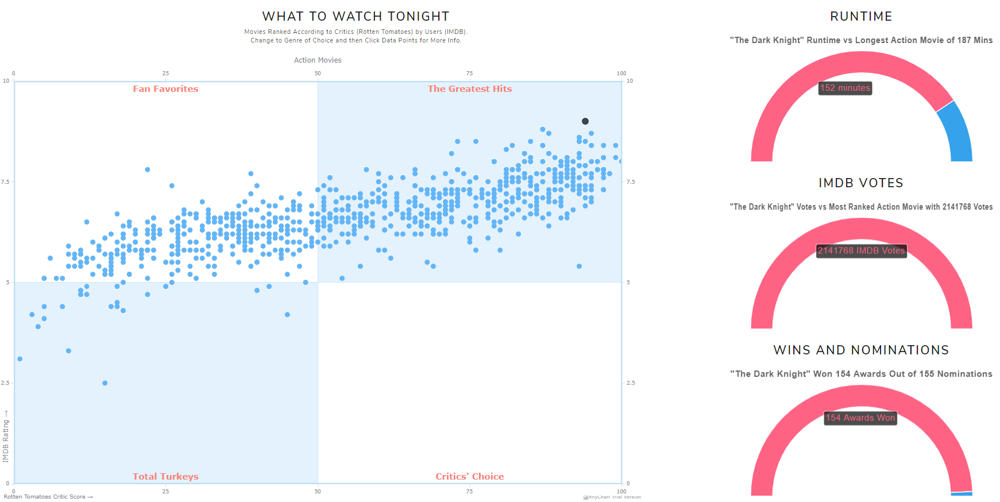

# MovieFinder

## Table of contents

* [General info](#general-info)
* [Technologies](#technologies)
* [Development Process](#development-process)

## General info

This project provides users an opportunity to explore and choose movies based on various parameters. To do this, we munged data from [OMDb](http://www.omdbapi.com/) and [The Movie DB](https://www.themoviedb.org/?language=en-US), and merged the data to a PostreSQL database. We then created an interactive quadrant chart, which displays movie selection based on user-chosen parameters. The user can select a movie, and additional information about the movie is displayed.

## Technologies

### Languages Used

* Python
* Javascript
* CSS
* HTML
* SQL

### Data Extraction and Munging

* Jupyter notebook - version 4.1
* Python - version 3.7.3
* Pandas - version 0.23.4
* Numpy - version 1.15.4
* Requests - version 2.22.0

### Database

* Python - version 3.7.3
* PostgreSQL - version 4.13
* SQLAlchemy - version 1.2.15

### Data Rendering and Visualization

* Flask - version 1.0.2
* Jinja2 - version 2.10
* Javascript Packages:
  * Chart - version 7.3
  * Chart.js Plugin Data Labels - version 7.0
  * d3 - version 5
  * JQuery - version 3.4.1
  * Plotly - version 1.49.1
  * Anychart - version 8.7.0
* HTML & CSS:
  * Bootstrap Customization - version 4.3.1
  * Bootswatch Lux - version 4.4.1
  * Popper.js - version 1.14.7

## Development Process

### Data Extraction

A python script was created to query The Movie Database (TMDB) and  the Open Movie Database (OMDB) API's. The Movie DB allowed us to retireve a list of movies based on user votes but did not provide us with as much information as OMDb, where we could only seach for movies by title. We ran the [OMDB.ipynb](../master/OMDB.ipynb) file to retrieve a list of movies from The Movie DB by vote count.  We used the "original title" data and created a loop to gather the data for each of the movie titles from OMDb. Data was cleaned with pandas, regex and python list comprehension. The data collected was exported to a CSV file, and then the CSV file was loaded in a PostgreSQL database using the [SQL_Load.ipynb](../master/SQL_Load.ipynb)

### Instructions
Install the above dependencies. 

If you choose to extract your own data from OMDB and TMDB, you will need to sign up for API keys from The Movie Database (TMDB) at https://www.themoviedb.org/account/signup?language=en-US and the Open Movie Database (OMDB) at http://www.omdbapi.com/apikey.aspx.
* Create a python file named config2.py. 
* Assign your TMDB key to the variable "tmdb_key", assign your OMDB key to the variable "omdb_key" and assign your PostgreSQL password to the variable "pwrd".
* Run OMDB.ipynb. This will first run an API call on the TMDB API. The information from this API call will be used to run an API loop on the OMDB API. ***Note that you will need to be an OMDB Pateron to make more than 1,000 API calls/day to their API.
* The data will be stored as a CSV to the data folder named 'movies.csv'. 

Alternatively, you may load the movies.csv file already provided in the data folder directly into PostgreSQL.  You will still need a config2.py file with the variable "pwrd" defined as your PostgreSQL password.
* Whichever you choose. load the movies.csv data to your PostgreSQL, run SQL_Load.ipynb. ***Make sure your user name and host name are correct under the variable "rds_connection_string".
* Run the app.py file in Python Terminal to start the web app. 

## Resources

* [OMDb](http://www.omdbapi.com/) Provides a variety of movie data including runtime, director, actors, genres, multiple rating scores, award information,and  movie poster.
* [The Movie DB](https://www.themoviedb.org/?language=en-US) Provides a variety of movie data including: popularity, revenue, and title.
* [Code Pen](https://codepen.io/patxipierce/pen/oyeNMj) Gauge code
* [Any Chart](https://www.anychart.com/) quadrant chart documentation
* [Chart.js](https://www.chartjs.org/) Chart js usage and documentation

## Authors
* Brendan Law (M1Bren)
* Billy Martinez (bmatz0729)
* Melissa Mason (MelMason)
* Jacqueline McBean-Blake (jacquiemcb)
* Keith Woodfin (woodfin8)

